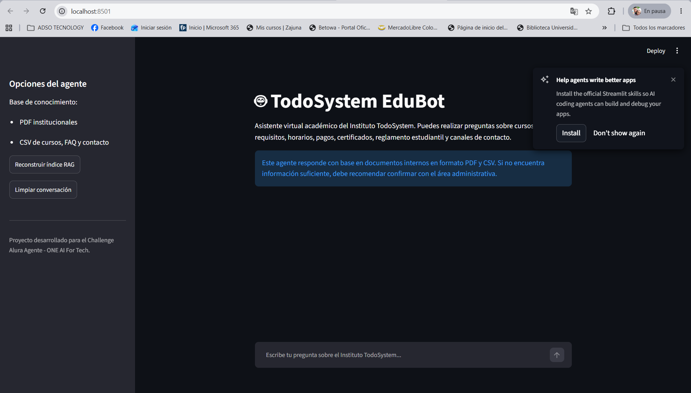
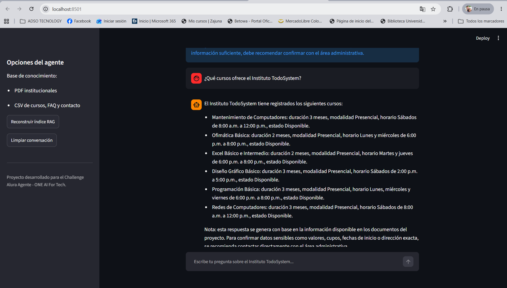
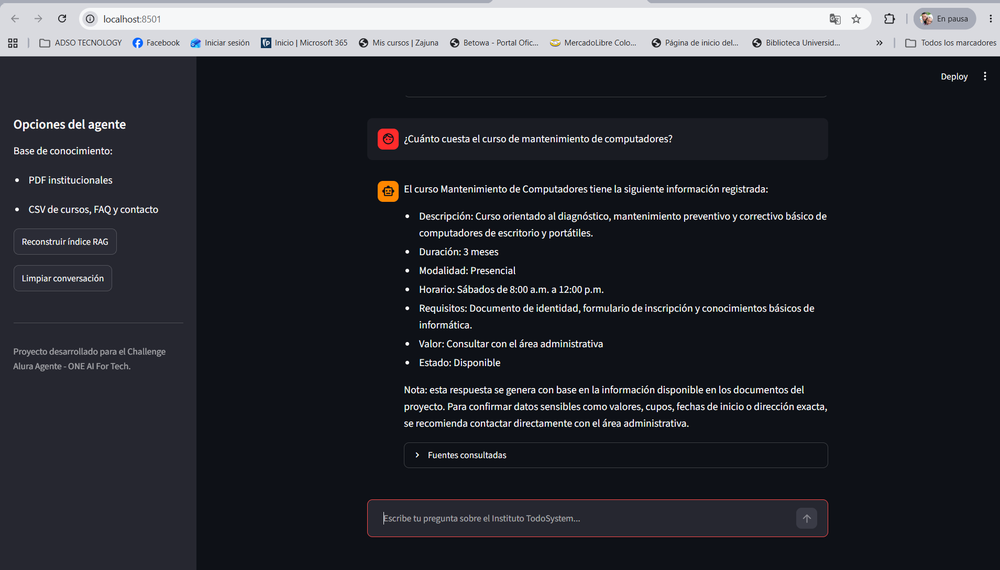
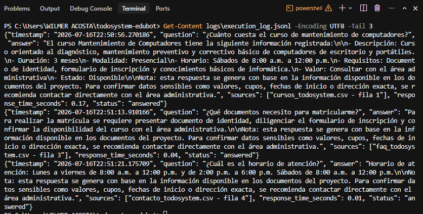
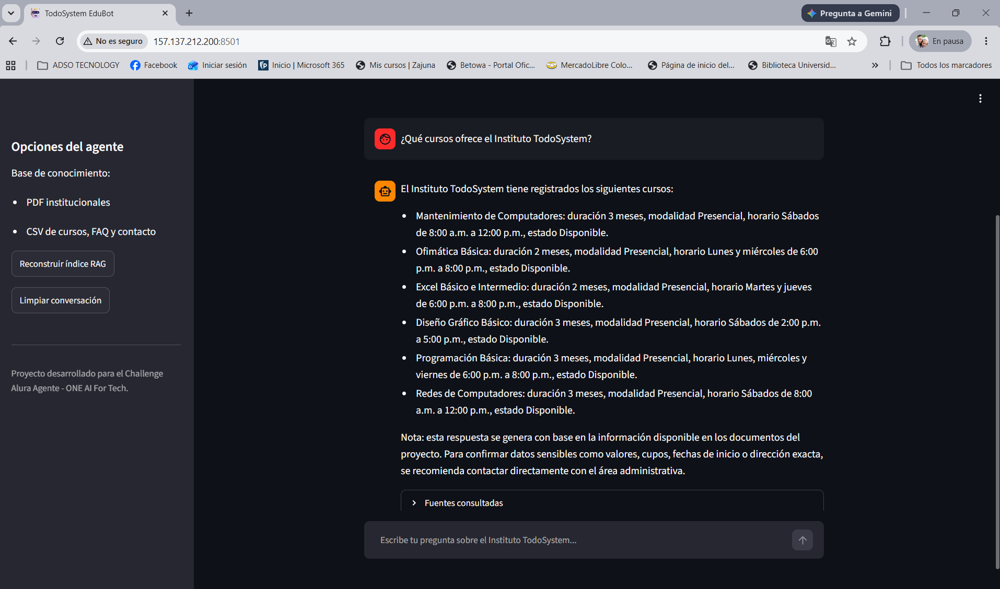

# TodoSystem EduBot

TodoSystem EduBot es un agente inteligente academico desarrollado para apoyar la atencion institucional del Instituto TodoSystem.

El agente permite responder preguntas en lenguaje natural sobre cursos, matriculas, requisitos, horarios, pagos, certificados, beneficios, reglamento estudiantil y canales de contacto.

La solucion utiliza una arquitectura RAG para consultar informacion desde documentos internos en formato PDF y CSV.

---

## Estado del proyecto

Proyecto en desarrollo para el **Challenge Alura Agente - ONE AI For Tech**.

Estado actual:

- Base de conocimiento creada en PDF y CSV.
- Pipeline RAG funcional.
- Agente de respuesta implementado.
- Interfaz web construida con Streamlit.
- Pruebas funcionales documentadas.
- Documentacion tecnica inicial creada.
- Guia de despliegue en Oracle Cloud Infrastructure documentada.
- Despliegue en OCI realizado correctamente.

---

## Objetivo del proyecto

Desarrollar un agente de inteligencia artificial capaz de responder preguntas institucionales con base en documentos internos del Instituto TodoSystem.

El agente busca centralizar informacion academica y administrativa para facilitar la consulta de cursos, procesos de matricula, horarios, pagos, certificados y reglamento estudiantil.

---

## Problema que resuelve

En muchas instituciones educativas, la informacion sobre cursos, matriculas, requisitos, pagos y reglamentos se encuentra distribuida en diferentes documentos o depende de la atencion manual del personal administrativo.

TodoSystem EduBot propone una solucion conversacional que permite consultar esa informacion de forma rapida, organizada y con fuentes documentales.

---

## Tecnologias utilizadas

El proyecto utiliza las siguientes tecnologias:

| Tecnologia | Uso en el proyecto |
|---|---|
| Python | Lenguaje principal de desarrollo. |
| Streamlit | Creacion de la interfaz web del agente. |
| Pandas | Lectura y procesamiento de archivos CSV. |
| PyPDF | Extraccion de texto desde documentos PDF. |
| ChromaDB | Base vectorial para almacenar y buscar embeddings. |
| Sentence Transformers | Generacion de embeddings para busqueda semantica. |
| ReportLab | Generacion de documentos PDF desde archivos Markdown. |
| Git y GitHub | Control de versiones y publicacion del repositorio. |
| Oracle Cloud Infrastructure | Plataforma prevista para el despliegue en la nube. |

---

## Estructura del proyecto

La estructura principal del proyecto es la siguiente:

```text
todosystem-edubot/
|-- app/
|   |-- main.py
|   |-- agent.py
|   |-- rag_pipeline.py
|   |-- prompts.py
|   |-- config.py
|-- data/
|   |-- pdfs/
|   |-- csv/
|-- docs/
|   |-- arquitectura.md
|   |-- pruebas.md
|   |-- despliegue_oci.md
|   |-- evidencias.md
|-- assets/
|-- logs/
|-- scripts/
|-- tests/
|-- vectorstore/
|-- requirements.txt
|-- README.md
|-- LICENSE
```

Esta organizacion separa el codigo de la aplicacion, la base de conocimiento, la documentacion, las evidencias y los archivos de configuracion del proyecto.

---

## Base de conocimiento

La base de conocimiento de TodoSystem EduBot esta compuesta por archivos PDF y CSV creados para el proyecto academico.

### Archivos CSV

```text
data/csv/cursos_todosystem.csv
data/csv/faq_todosystem.csv
data/csv/contacto_todosystem.csv
```

Estos archivos contienen informacion estructurada sobre cursos, preguntas frecuentes y datos de contacto del Instituto TodoSystem.

### Archivos PDF

```text
data/pdfs/guia_matricula_todosystem.pdf
data/pdfs/reglamento_estudiantil_todosystem.pdf
data/pdfs/politica_pagos_reembolsos_todosystem.pdf
```

Estos documentos contienen informacion institucional relacionada con matricula, reglamento estudiantil, pagos y reembolsos.

---

## Funcionamiento general

El funcionamiento del agente se basa en una arquitectura RAG.

El flujo principal es:

1. El usuario realiza una pregunta desde la interfaz web.
2. La pregunta es recibida por la aplicacion desarrollada en Streamlit.
3. El agente analiza la pregunta.
4. Si la pregunta es sobre contacto, ubicacion u horario, consulta directamente `contacto_todosystem.csv`.
5. Si la pregunta es sobre cursos disponibles, consulta directamente `cursos_todosystem.csv`.
6. Para otras preguntas, el sistema utiliza el pipeline RAG.
7. El pipeline RAG busca fragmentos relevantes en la base vectorial ChromaDB.
8. El agente genera una respuesta clara y muestra las fuentes consultadas.

Esta logica permite mejorar la precision del agente y reducir respuestas fuera de contexto.

---

## Instalacion local

Para ejecutar el proyecto de forma local, se deben seguir estos pasos:

### 1. Clonar el repositorio

```bash
git clone https://github.com/WAV9874/todosystem-edubot.git
```

### 2. Ingresar a la carpeta del proyecto

```bash
cd todosystem-edubot
```

### 3. Crear entorno virtual

En Windows:

```powershell
python -m venv .venv
```

### 4. Activar entorno virtual

En Windows PowerShell:

```powershell
.venv\Scripts\activate
```

### 5. Instalar dependencias

```powershell
pip install -r requirements.txt
```

### 6. Ejecutar la aplicacion

```powershell
python -m streamlit run app/main.py
```

La aplicacion se abrira en el navegador en una direccion similar a:

```text
http://localhost:8501
```

---

## Pruebas funcionales

Se realizaron pruebas funcionales para validar que el agente responde correctamente preguntas sobre informacion institucional del Instituto TodoSystem.

Algunas preguntas probadas fueron:

- Que documentos necesito para matricularme?
- En donde estan ubicados?
- Cual es la direccion del instituto?
- Cual es el horario de atencion?
- Que cursos ofrece el Instituto TodoSystem?
- Cuanto cuesta el curso de mantenimiento de computadores?

Resultados principales:

- El agente responde preguntas sobre matricula.
- El agente responde preguntas sobre ubicacion y contacto.
- El agente lista los cursos disponibles.
- El agente no inventa precios cuando no tiene informacion exacta.
- El agente muestra las fuentes consultadas.

La documentacion completa de pruebas se encuentra en:

```text
docs/pruebas.md
```

---

## Evidencias visuales

A continuación se presentan algunas evidencias del funcionamiento local y en la nube de TodoSystem EduBot.

### Interfaz principal



### Consulta de cursos disponibles



### Consulta de precio sin inventar información



### Registro de logs de ejecución



### Despliegue en Oracle Cloud Infrastructure OCI

La siguiente imagen evidencia el funcionamiento de TodoSystem EduBot desplegado en Oracle Cloud Infrastructure, ejecutándose mediante una instancia de cómputo y disponible desde una dirección IP pública en el puerto 8501.

Enlace público temporal de la aplicación desplegada:

http://157.137.212.200:8501

Nota: este enlace depende de que la instancia de OCI permanezca encendida. Si la instancia se elimina o se apaga, la URL puede dejar de estar disponible o cambiar.



## Ejemplos de preguntas y respuestas del agente

### Pregunta 1

¿Qué cursos ofrece el Instituto TodoSystem?

### Respuesta esperada

El agente responde con los cursos registrados en la base de conocimiento, incluyendo Mantenimiento de Computadores, Ofimática Básica, Excel Básico e Intermedio, Diseño Gráfico Básico, Programación Básica y Redes de Computadores. También muestra información como duración, modalidad, horario y estado del curso.

### Pregunta 2

¿Cuánto cuesta el curso de mantenimiento de computadores?

### Respuesta esperada

El agente responde que el curso de Mantenimiento de Computadores tiene una duración de 3 meses, modalidad presencial, horario los sábados de 8:00 a.m. a 12:00 p.m., y que el valor debe ser consultado con el área administrativa. De esta forma evita inventar precios no registrados en la base de conocimiento.

### Pregunta 3

¿Qué documentos necesito para matricularme?

### Respuesta esperada

El agente responde con los documentos requeridos según la información disponible en la base de conocimiento, como documento de identidad, formulario de inscripción y demás requisitos definidos para el proceso de matrícula.